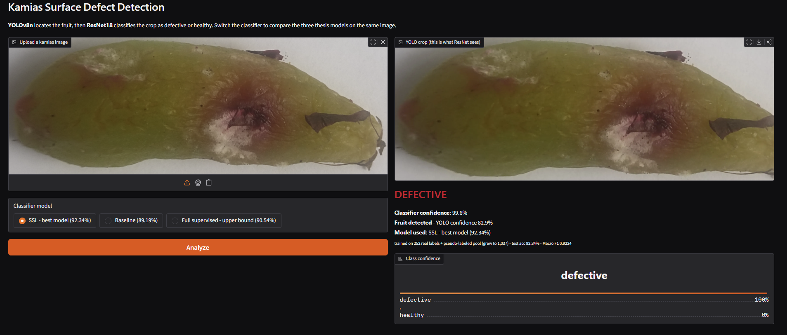

# Kamias Surface Defect Detection

A data-efficient, two-stage computer-vision pipeline for detecting surface defects
on kamias (_Averrhoa bilimbi_) fruit. **YOLOv8n** locates the fruit in a photo and
crops it; **ResNet18** then classifies the crop as `defective` or `healthy`.

The core contribution is a **semi-supervised learning (SSL)** framework: using only
**252 real labels** plus pseudo-labels mined from an unlabeled pool, the classifier
matches — and slightly exceeds — a fully supervised model trained on 1,014 labels,
while cutting the number of **missed defects by 60%**.



> Undergraduate thesis, BS Computer Science, Mapúa University — Group 16.
> Ryonan Owen Ferrer, Jean Rhyan L. Lopez, Gian Carlo B. Palma.
> Adviser: Joel C. De Goma.

---

## Results

Evaluated on a held-out test set of **222 images** (seed 42).

| Model                         | Weights               | Trained on                                       | Test accuracy                              | Macro F1   | Missed defects (FN) |
| ----------------------------- | --------------------- | ------------------------------------------------ | ------------------------------------------ | ---------- | ------------------- |
| Baseline (supervised)         | `resnet_baseline.pth` | 252 labeled images                               | 89.19%                                     | 0.8915     | 15                  |
| **SSL (best)**                | `resnet_ssl.pth`      | 252 labels + pseudo-labeled pool (grew to 1,037) | **92.34%**                                 | **0.9224** | **6**               |
| Full (supervised upper bound) | `resnet_full.pth`     | 1,014 labeled images                             | 90.54%                                     | 0.9051     | —                   |
| YOLOv8n detector              | `yolov8_kamias.pt`    | single-class detection                           | Precision 1.00 · Recall 1.00 · mAP50 0.995 | —          | —                   |

**Headline:** the SSL model reduced false negatives (defective fruit wrongly passed as
healthy) from **15 to 6 — a 60% reduction** — using only a quarter of the labels the
full model needed. The remaining error budget also shifted toward the less costly
error type (false alarms rather than missed defects).

You can reproduce this comparison at any time with `python scripts/find_money_shot.py`.

---

## The pipeline

```
photo ─▶ YOLOv8n detector ─▶ crop the fruit ─▶ ResNet18 classifier ─▶ defective / healthy
        (yolov8_kamias.pt)     (bounding box)     (224×224, ImageNet-normalized)
```

- **Detector:** YOLOv8n, input 640×640, single class (`kamias`).
- **Classifier:** ResNet18 pretrained on ImageNet, final layer replaced with a 2-class
  head. Input 224×224, ImageNet mean/std normalization (required for the pretrained
  backbone). Class indices are alphabetical: `defective = 0`, `healthy = 1`.

---

## Repository structure

```
kamias-defect-detection/
├── app.py                     # Gradio demo: upload a photo → YOLO crop → prediction
├── requirements.txt           # pinned dependencies (see Setup)
├── models/                    # trained weights (see "Data & weights" note below)
│   ├── yolov8_kamias.pt       #   trained detector
│   ├── resnet_baseline.pth    #   252 labeled images
│   ├── resnet_ssl.pth         #   semi-supervised — best model
│   └── resnet_full.pth        #   full supervised upper bound
├── dataset/
│   ├── train/  val/  test/    # cropped classifier splits (defective/ , healthy/)
│   ├── train_labeled/         # 252-image labeled seed for SSL
│   └── yolo/                  # detection dataset (images/, labels/, kamias.yaml)
├── outputs/                   # crops, plots, and demo money-shot images
└── scripts/
    ├── train_yolo.py          # train the YOLOv8n detector
    ├── crop_for_classifier.py # run YOLO over raw images → cropped classifier inputs
    ├── split_dataset.py       # deterministic train/val/test split (seed 42)
    ├── prepare_ssl_split.py   # carve the 252-label seed + unlabeled pool
    ├── train_resnet.py        # train ResNet — MODE = "baseline" | "ssl" | "full"
    ├── pseudo_label.py        # SSL loop: pseudo-label the pool + retrain
    ├── evaluate.py            # test-set metrics for a given model
    ├── classifier.py          # batch-classify a folder of crops
    ├── plot_results.py        # generate result figures
    ├── compute_kappa.py       # inter-annotator agreement (Cohen's kappa)
    ├── sample_for_kappa.py    # sample images for the agreement study
    ├── count_dataset.py       # dataset composition audit
    ├── check_pseudo.py        # pseudo-label accuracy audit
    └── find_money_shot.py     # find the strongest demo images for the video
```

> **Data & weights.** `dataset/`, `outputs/`, and all model weights (`*.pt`, `*.pth`)
> are excluded from Git via `.gitignore` because of their size. They are provided in the
> submission archive. The dataset can also be re-split from the raw images, and every
> weight file can be regenerated from scratch using the commands under
> "Reproducing the results."

---

## Setup

**Requirements:** Python 3.11–3.14 (developed on 3.14), an NVIDIA GPU with CUDA 12.8
(CPU works but is slower).

Developed and tested on Windows 11, NVIDIA GeForce RTX 5060 (8 GB, Blackwell `sm_120`),
PyTorch 2.11.0 + cu128, CUDA 12.8.

> **RTX 50-series note.** Blackwell GPUs (`sm_120`) require the CUDA 12.8 PyTorch build
> (`cu128`) or newer. `requirements.txt` already pins this build. For a different CUDA
> version or a CPU-only setup, edit the two `torch` lines at the top of that file — the
> comments there explain how.

```powershell
# 1. Clone and enter the project
git clone https://github.com/Ry0nan/kamias-defect-detection.git
cd kamias-defect-detection

# 2. Create and activate a virtual environment
python -m venv venv
.\venv\Scripts\Activate.ps1        # Windows PowerShell
# source venv/bin/activate         # macOS / Linux

# 3. Install all dependencies (this includes the CUDA 12.8 PyTorch build)
pip install -r requirements.txt
```

---

## Running the demo

With the environment active and the weights present in `models/`:

```powershell
python app.py
```

Open the local URL it prints (default `http://127.0.0.1:7860`). Upload a kamias photo,
choose a classifier (Baseline / SSL / Full), and click **Analyze**. The app shows the
YOLO crop, the prediction, the confidence, and which model produced it. Switching the
model on the same image demonstrates the thesis comparison live.

---

## Reproducing the results

Each training step reads its configuration from constants near the top of the relevant
script (for example, `MODE` in `train_resnet.py` and `MODEL_PATH` in `evaluate.py`).
Run these from inside the `scripts/` folder, in order:

```powershell
cd scripts

# 1. Train the detector
python train_yolo.py

# 2. Crop raw images into classifier inputs
python crop_for_classifier.py

# 3. Split into train / val / test (seed 42)
python split_dataset.py

# 4. Carve the 252-label seed and the unlabeled pool
python prepare_ssl_split.py

# 5. Train the supervised baseline        (set MODE = "baseline" in train_resnet.py)
python train_resnet.py

# 6. Run the semi-supervised loop -> resnet_ssl.pth
python pseudo_label.py

# 7. Train the full upper bound            (set MODE = "full" in train_resnet.py)
python train_resnet.py

# 8. Evaluate each model                   (set MODEL_PATH per model in evaluate.py)
python evaluate.py

# 9. Generate figures
python plot_results.py
```

---

## Citation

> Ferrer, R. O., Lopez, J. R. L., & Palma, G. C. B. (2026). _A Data-Efficient
> Semi-Supervised Learning Framework for Automated Kamias (Averrhoa bilimbi) Surface
> Defect Detection Using YOLOv8 and ResNet18._ Undergraduate thesis, Mapúa University.
